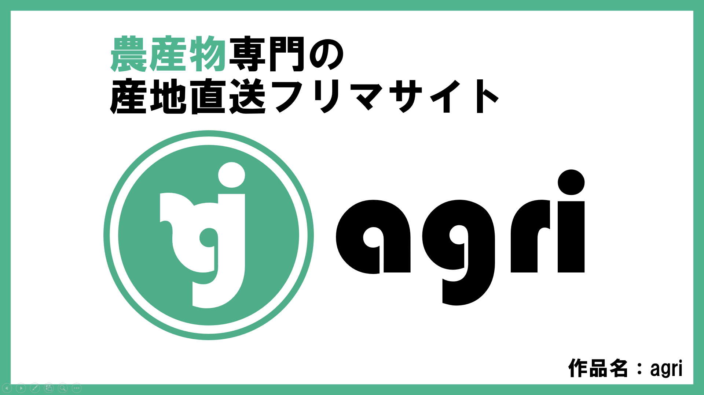
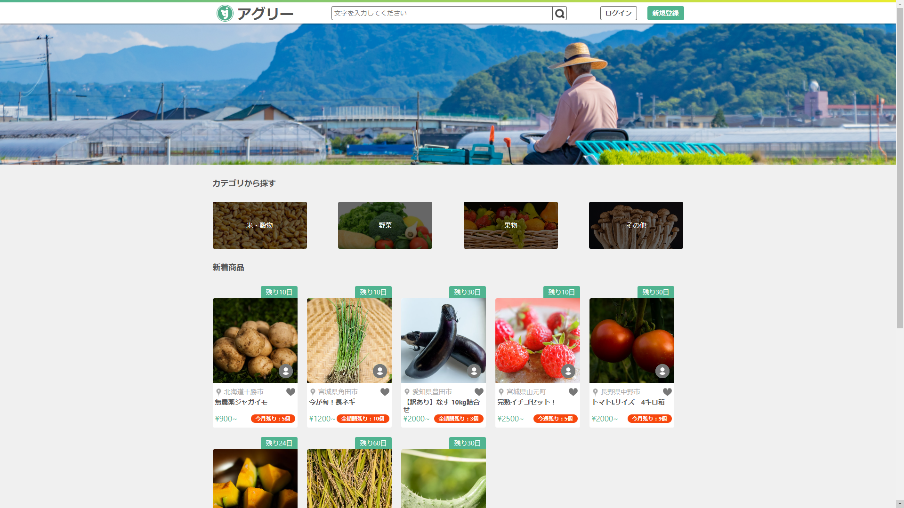
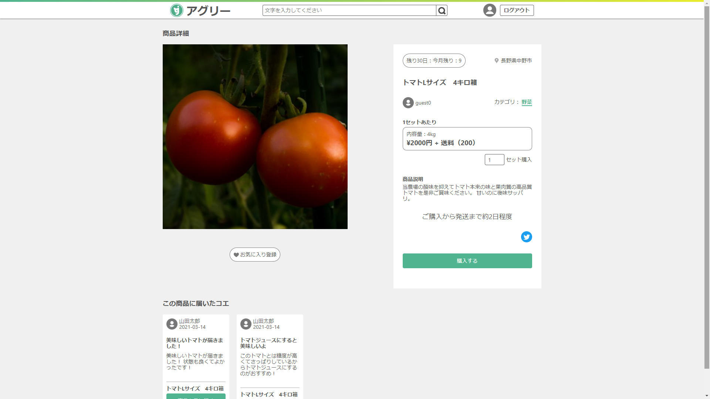
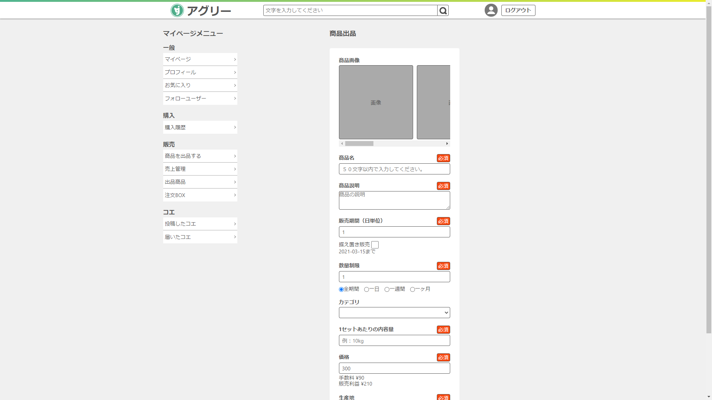
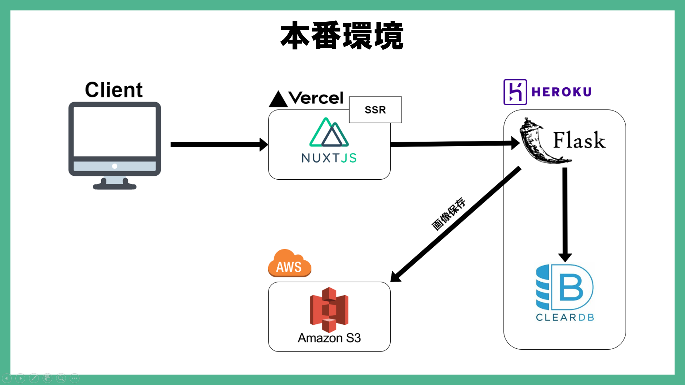

# 農産物フリマサイト「アグリー」











## 概要
2年次の進級作品として制作した農作物の売買を専門にしたフリマサイトです。  
[プレゼンテーションスライド](https://speakerdeck.com/bonybody/agripurezensuraido)

## 背景
企画段階で、当時特に猛威を奮っていた新型コロナウイルス感染拡大によって起きた問題を調査したところ、主に給食や飲食、インバウンド消費からの農産物需要が低迷していることを知りました。  
この問題を解決するために、「既存の市場に依存せず、生産者と消費者が直接やり取りが出来るプラットフォーム」が必要だと考え、農産物専門のフリマサイトというテーマに至りました。

## ポイント
約1年程の時間を掛けての開発だったため、特に企画、要件定義に力を入れました。  
企画ではサービスの意義を、要件定義では説得力をもたせるため、想定するユーザー層である農家さんに実際にお話を伺うなど徹底したユーザー意識を心がけていました。

## 工夫した点（技術面）
 - フロントエンドではNuxt.jsのSSRモードを選定し、SPAでありながら商品詳細ページの動的なOGPに対応しました。
 - 色や余白のパターンをSCSS変数に格納し再利用出来るようにしたり、Atomic Designを簡易的に取り入れたコンポーネント設計でデザインのシステム化を図りました。
 - チームメンバーの環境で簡単に開発環境を再現するためにDockerで環境をコード化しました。
 
## セットアップ
1から順番に実行していく
```bash
# 1 リポジトリのクローン
$ git clone https://github.com/bonybody/2020_hew_app.git

# 2 コンテナイメージの作成
$ docker-compose build
# ※2 コンテナイメージの作成（ビルドキャッシュを利用しない）
$ docker-compose build --no-cache

# 3 frontのモジュール群をインスール
$ docker-compose run --rm front npm install

# 4 コンテナの起動
$ docker-compose up
# ※4 コンテナの起動（logを表示しない）
$ docker-compose up -d
```

## それぞれのサービスで公開されるURI
- front **localhost:8001**
- api **localhost:8002**
- db **localhost:3306** ※他のデータベースが起動されているとポート（3306）が競合するので注意）

## 公式ドキュメントリンク
- [Nuxt.js（front）](https://ja.nuxtjs.org/)
- [Flask（api）](https://flask.palletsprojects.com/)
- [mariaDB（db）](https://mariadb.com/kb/ja/mariadb/)
